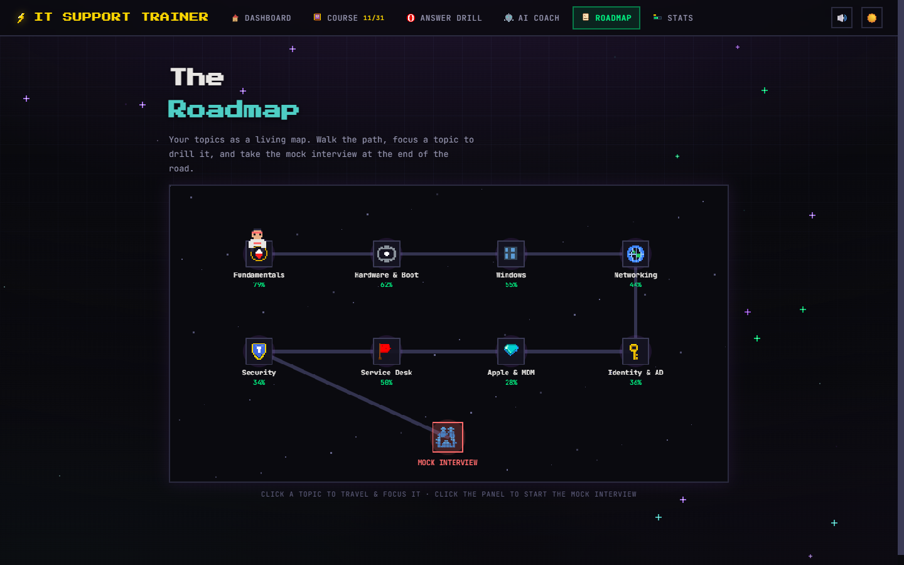
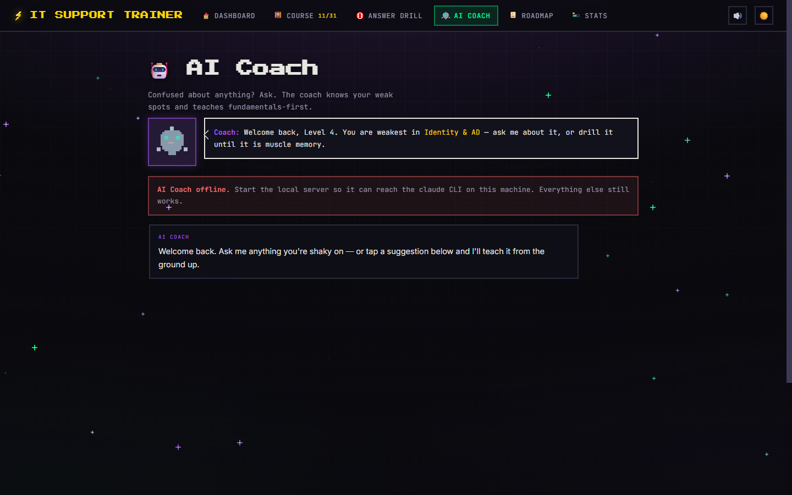

# IT Support Trainer — a Service Desk Arcade

A single-file, pixel-art browser game for drilling **Tier 1/2 IT support** interview
material — troubleshooting method, the PC boot chain, Windows internals, networking,
Active Directory, Apple/MDM, service-desk ops, and security basics. Study turns into a
retro arcade: earn XP, climb ranks, walk a roadmap of topics, and face a **mock interview**
panel as the final boss.

> **▶ Live demo:** https://ameeromer202-it.github.io/it-support-trainer/
> The full game — Course, Match, the roadmap, XP and progress — runs entirely in the
> browser with no backend. Two features (the **AI Coach** and **Answer Drill** grading)
> call a local Claude Code CLI via the included server; without it the rest of the game is
> unaffected (see [Running the Claude-powered features](#running-the-claude-powered-features)).

## Screenshots

**The dashboard** — rank and level, XP bar, streak, where-you-left-off, and the countdown.


**The roadmap** — a Canvas-2D map of the eight topics; walk between nodes, each showing your
mastery %, and follow the road to the mock interview.



**The AI Coach** — an in-app tutor that reads your weakest topic and teaches it, powered by Claude.



## What's inside

- **The Course** — chapters of bite-sized cards across 8 topics (Fundamentals, Hardware & Boot,
  Windows, Networking, Identity & AD, Apple & MDM, Service Desk, Security). Each card teaches
  one concept fundamentals-first, with the "one sentence that separates a tech from a good tech."
- **Match** — a timed arcade drill with a decaying **chain multiplier** and best-time chase.
- **Mock Interview** — a 16-scenario boss run: 3 lives, real-world tickets, headline-first answers.
- **Roadmap** — a hand-rolled Canvas-2D map; walk a pixel avatar between topic nodes toward the
  mock interview, each node showing your mastery %.
- **AI Coach** — an in-app tutor that teaches your weakest topic, powered by Claude.
- **Answer Drill** — say an answer out loud, type it, and Claude grades the **beats** (content
  and structure) — never your phrasing or tone.
- **Progress & juice** — persistent XP/level/streak, ZzFX sound effects, confetti, screen-shake,
  level-up flashes, and a light/dark retro theme.

## Tech

- **One file, zero build.** `index.html` is vanilla HTML/CSS/JS — no framework, no bundler,
  no runtime dependencies. Open it and it runs.
- **Pixel-art UI** in a retro-arcade design language: `Press Start 2P` / `JetBrains Mono`,
  sharp 0-radius components, tinted-outline chips and cards, segmented progress bars, and
  ~50 hand-rendered pixel icons drawn to inline SVG from grid data.
- **Canvas-2D roadmap** drawn synchronously (not `requestAnimationFrame`-gated) so it renders
  deterministically everywhere.
- **No image assets.** The background (neon gradient, grid, CRT scanlines) and every icon are
  pure CSS and inline SVG — there is not a single raster image in the page.
- **Audio** via [ZzFX](https://github.com/KilledByAPixel/ZzFX) (SFX only), confetti via
  [canvas-confetti], motion via [anime.js] — all inlined.
- **AI features** shell out to a local [Claude Code](https://claude.com/claude-code) CLI
  through `serve.py` (Python standard library only) — no API key, runs on your subscription.

## Run it locally

Static (everything except the AI Coach and Answer Drill):

```bash
# any static server works, e.g.
python -m http.server 8377
# then open http://localhost:8377/
```

### Running the Claude-powered features

The **AI Coach** and **Answer Drill** grading need `serve.py` (adds `/ask-claude`) and a local
[Claude Code](https://claude.com/claude-code) CLI on your `PATH`:

```bash
python serve.py
# open http://localhost:8377/
```

`serve.py` uses only the Python standard library. It runs `claude -p` headless on your machine,
so it uses your local Claude Code install/subscription — **no API key required**. If the CLI
isn't found, the game detects it and those two features go quietly offline while the rest keeps
working.

## Notes

- Set your own interview date near the top of `index.html` (`const INTERVIEW = ...`) to make the
  dashboard countdown real; it defaults to 14 days out so the countdown is always live.
- Game state saves to `localStorage` in the browser, and (when the server is running) a coaching
  snapshot is written to `game/dojo-progress.json` for the coach to read.

## License

MIT — see [LICENSE](LICENSE).
